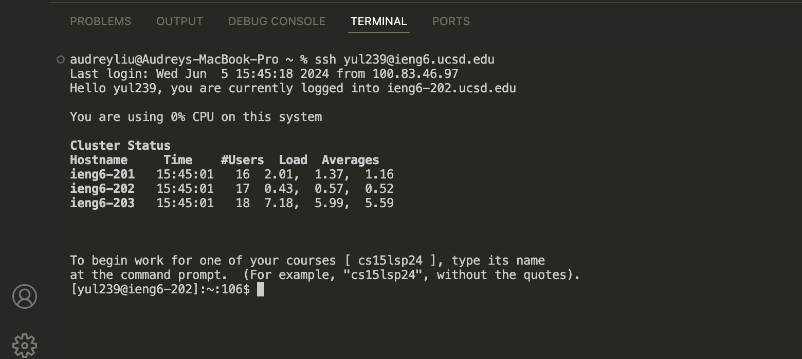
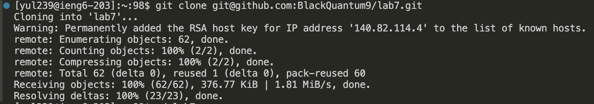
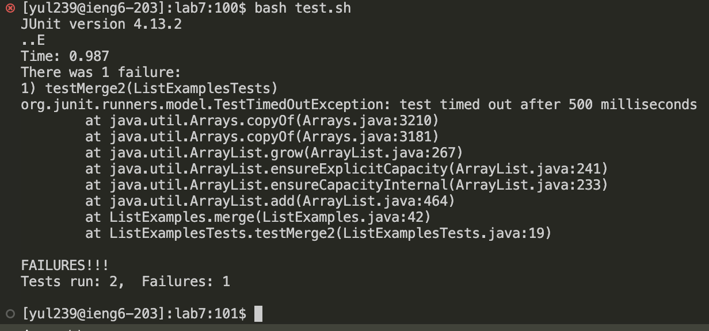
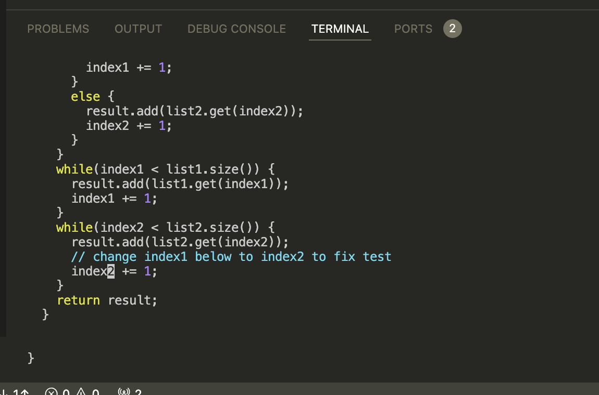
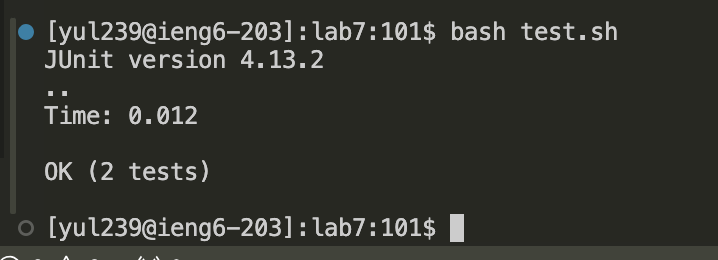
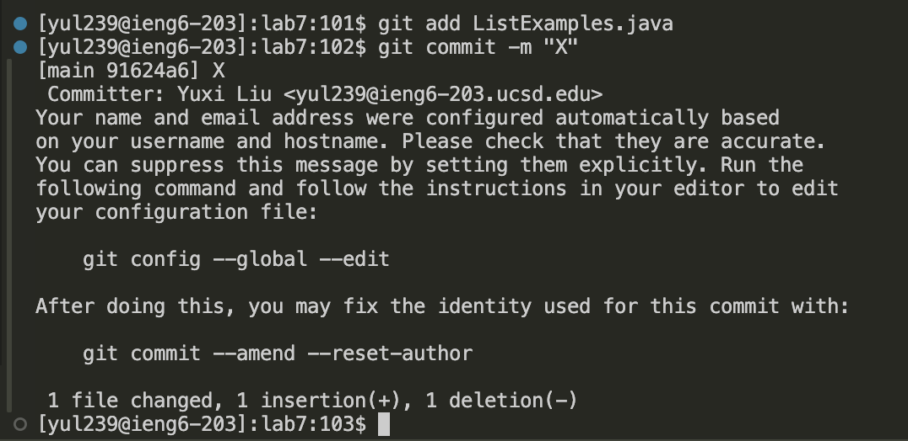

## Step 4: Log into ieng6

> Click on `Remote Explorer`, then `ssh`, `ieng6.ucsd`, and finally click on `yul239`. At this point, it is connected to ieng6.
>
> 
## Step 5: Clone your fork of the repository from your GitHub account (using the SSH URL)

> Type `git<space>clone<space>`, then paste the SSH URL `git@github.com:BlackQuantum9/lab7.git` which is got from the forked gitbub page next to it. Then press `enter` to clone the entire repo.
## Step 6: Run the tests, demonstrating that they fail

## Step 7: Edit the code file to fix the failing test

## Step 8: Run the tests, demonstrating that they now succeed

## Step 9: Commit and push the resulting change to your GitHub account (you can pick any commit message!)

